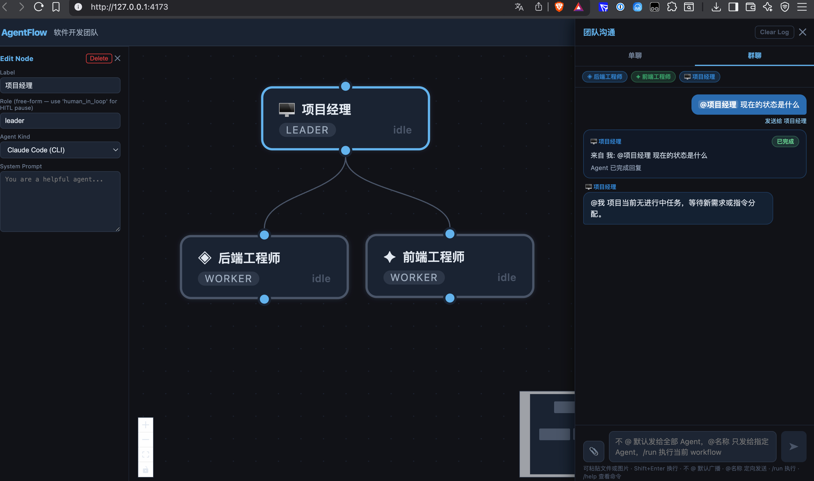

# cooperation

cooperation is a multi-agent collaboration platform for building, coordinating,
and running role-based AI teams.

Instead of treating one model or one CLI as "the agent", cooperation lets you
assign different roles to different agents, connect them into a workflow, and
coordinate them through a shared chat surface.



## Why This Project Exists

The agent ecosystem moves too fast.

New models, APIs, and CLI agents appear constantly. They improve at different
speeds, expose different toolchains, and excel at different kinds of work. A
single agent is rarely the best choice for every task.

cooperation exists to solve that problem:

- Use multiple agents in one system instead of betting on a single runtime
- Give each agent a clear role and responsibility
- Let agents collaborate to finish a task together
- Keep the orchestration layer stable even when individual agents change fast

In short: agents are evolving quickly and unevenly, so this project provides a
shared platform where specialized agents can work together as a team.

## Core Idea

cooperation turns AI work into team collaboration:

- a planner can break down work
- an executor can implement or research
- a reviewer can validate results
- a human can step in when approval is required

Each agent gets a role, a model/runtime, and a place in the workflow. The
platform handles routing, execution, chat coordination, and state tracking.

## Project Highlights

### 1. Role-Based Multi-Agent Collaboration

Define agents with different responsibilities and let them collaborate on the
same task instead of overloading one general-purpose assistant.

### 2. Mixed Agent Runtimes

cooperation supports different agent styles in one workspace:

- raw API-based LLM agents
- Claude Code CLI agents
- Gemini CLI agents
- Codex CLI agents

This makes it easier to combine different strengths in one system.

### 3. Visual Workflow Builder

Build agent teams as a graph:

- add agent nodes
- connect responsibilities
- insert review checkpoints
- save and reload workflows

The canvas gives you a structural view of how work flows across the team.

### 4. Chat-Native Coordination

Collaboration does not only happen on the canvas. It also happens in chat.

cooperation supports:

- individual chat with a single agent
- group chat for team coordination
- `@mentions` to route a message to a specific agent
- chat commands such as `/add-agent` and `/run`

This lets you coordinate work conversationally while still keeping workflow
structure explicit.

### 5. Human-in-the-Loop Checkpoints

Some tasks should not run end-to-end without review.

cooperation supports human review nodes so a workflow can pause, request a
decision, and continue only after approval or rejection.

### 6. Attachment-Aware Context

Group chat and workflow runs can include attached documents. The backend parses
supported files into text context and injects that context into collaboration
and execution flows.

### 7. Persistent Team State

The platform persists workflow definitions, group chat history, and workflow
memory so collaboration does not disappear after a page refresh.

### 8. Operational Visibility

cooperation includes execution state, activity logs, and global memory views so
you can see what happened, what failed, and what context was produced.

## What Makes cooperation Different

cooperation is not just a prompt playground and not just a workflow editor.

It combines:

- workflow structure
- role assignment
- multi-agent routing
- chat-based coordination
- human approval
- persistent state

The result is a platform for orchestrating AI teams, not just calling a model.

## Architecture

- `frontend/`: React + Vite application
- `backend/`: Rust services for APIs, orchestration, memory, and WebSocket events
- `frontend/src-tauri/`: Tauri desktop shell that embeds and auto-starts the backend

## Quick Start

### Desktop App (Tauri)

```bash
cd frontend
npm install
npm run tauri:dev
```

This launches the Vite frontend in a Tauri desktop window and auto-starts the
embedded backend on an automatically assigned localhost port.

### Backend

```bash
cd backend
cp -n .env.example .env
set -a
source .env
set +a
cargo run -p agentflow-server
```

### Frontend

```bash
cd frontend
npm install
npm run dev -- --host 127.0.0.1
```

Open:

```text
http://127.0.0.1:5173
```

## Platform Notes

- The browser frontend expects the backend at `http://127.0.0.1:8080`
- WebSocket events are served from `ws://127.0.0.1:8080/ws`
- The Tauri desktop app auto-starts the backend on an automatically assigned localhost port and stores its database in the
  app data directory as `cooperation.db`
- Optional CLI-based agent modes require the matching local CLI to be installed

## Packaging

The desktop build is a single packaged application:

- the frontend is built by Vite
- the desktop shell is built by Tauri
- the Rust backend is linked into the desktop app and auto-starts on launch
- the desktop app allocates a localhost port dynamically, so it does not depend on a fixed `8080`

### What Gets Packaged

- `frontend/dist/`: built frontend assets
- `frontend/src-tauri/`: Tauri desktop shell
- `backend/crates/agentflow-server`: embedded backend server

The packaged desktop app does not require manually starting `frontend` and `backend`
as separate processes.

### Build Prerequisites

- Node.js and npm
- Rust toolchain
- platform-native build tools

Platform-specific requirements:

- macOS: Xcode Command Line Tools
- Windows: Microsoft C++ Build Tools and WebView2 runtime
- Linux: GTK/WebKitGTK development packages required by Tauri

Optional runtime dependencies:

- `claude`
- `gemini`
- `codex`

These are only required if you want packaged builds to use the CLI-native agent
modes. Raw API-based modes only require the corresponding API keys.

### Install Dependencies

```bash
cd frontend
npm install
```

### Verify Before Packaging

Run these checks first:

```bash
cd backend
cargo test
```

```bash
cd frontend
npm run build
```

```bash
cd frontend/src-tauri
cargo check
```

### Desktop Development Build

Use this when you want a desktop window with hot-reload:

```bash
cd frontend
npm run tauri:dev
```

This starts:

- the Vite dev server
- the Tauri desktop shell
- the embedded backend

### Debug Package Build

Use this when you want a packaged app quickly for local testing:

```bash
cd frontend
npm run tauri:build -- --debug
```

Typical debug outputs:

- macOS app bundle: `frontend/src-tauri/target/debug/bundle/macos/cooperation.app`
- macOS disk image: `frontend/src-tauri/target/debug/bundle/dmg/cooperation_0.1.0_x64.dmg`
- Windows executable: `frontend/src-tauri/target/debug/cooperation-desktop.exe`
- Windows installer artifacts: `frontend/src-tauri/target/debug/bundle/`

### Release Package Build

Use this for actual distribution:

```bash
cd frontend
npm run tauri:build
```

Typical release outputs:

- macOS app bundle: `frontend/src-tauri/target/release/bundle/macos/cooperation.app`
- macOS disk image: `frontend/src-tauri/target/release/bundle/dmg/`
- Windows executable: `frontend/src-tauri/target/release/cooperation-desktop.exe`
- Windows installer artifacts: `frontend/src-tauri/target/release/bundle/`

### Packaging on macOS

```bash
cd frontend
npm install
npm run tauri:build
```

Expected artifacts:

- `.app`
- `.dmg`

### Packaging on Windows

Build on Windows if you want native Windows artifacts:

```powershell
cd frontend
npm install
npm run tauri:build
```

Expected artifacts:

- `cooperation-desktop.exe`
- Windows bundle output under `frontend/src-tauri/target/release/bundle/`

If you specifically need a Windows installer for distribution, build on Windows
instead of trying to produce it from macOS.

### Packaging on Linux

```bash
cd frontend
npm install
npm run tauri:build
```

The exact installer formats depend on the Linux packaging toolchain available on
the build machine.

### Important Runtime Notes

- The packaged desktop app stores its database in the OS app data directory as
  `cooperation.db`
- The embedded backend chooses an available localhost port automatically
- Browser mode and desktop mode are separate:
  browser mode defaults to `127.0.0.1:8080`
  desktop mode injects a dynamic runtime endpoint into the frontend
- CLI-native agent modes still depend on the target machine having the
  corresponding CLI installed and authenticated

### Clean Rebuild

If packaging behaves unexpectedly, rebuild from a clean state:

```bash
cd frontend
rm -rf dist
rm -rf src-tauri/target
npm install
npm run tauri:build
```

### Current Verified Packaging Result

Verified in this workspace on macOS:

- `npm run tauri:build -- --debug`
- generated `cooperation.app`
- generated `.dmg`

## Additional Docs

- macOS setup and validation: [README-macos.md](./README-macos.md)

## Current Direction

cooperation is built around a simple belief:

AI systems will become more heterogeneous, not less.

The winning platform is not the one tied to a single agent. It is the one that
can continuously absorb new agents, assign them meaningful roles, and let them
collaborate reliably on real tasks.
